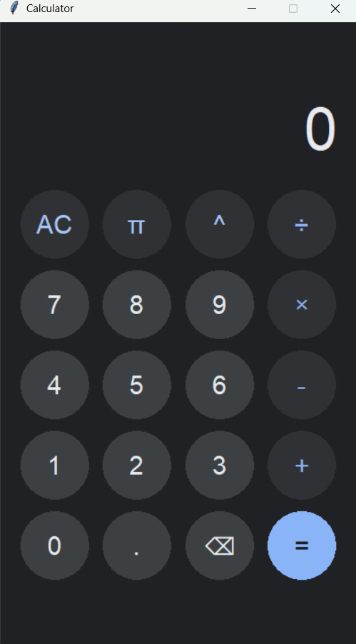

# Google Style Calculator (Tkinter)

A fast, lightweight, and aesthetically pleasing calculator application built with Python and Tkinter. This project mimics the modern **Google Pixel / AOSP** dark mode design, featuring custom circular buttons, clean typography, and essential scientific functions.

## 📸 Preview



## ✨ Features

* **Google Material Design:** Dark theme (`#202124`) with authentic colors for numbers, operators, and functions.
* **Custom UI:** Uses a custom `CircularButton` class based on Tkinter Canvas for perfectly anti-aliased, round buttons.
* **Smart Display:** Large, easy-to-read numbers that auto-resize (responsive logic ready).
* **Math Functions:**
    * Basic Arithmetic (`+`, `-`, `×`, `÷`)
    * Powers (`^`) and Pi (`π`)
    * Backspace (`⌫`) and Clear (`AC`)
* **Automatic Rounding:** Results are automatically rounded to **4 decimal places** for cleaner output.
* **Keyboard Support:** (Optional future addition)

## 🛠️ Requirements

* **Python 3.x**
* **Tkinter** (Usually included with standard Python installations)

## 🚀 How to Run

1.  **Clone the repository** (or download the source code):
    ```bash
    git clone [https://github.com/Jigen-Ohtsusuki/Tkinter_Calculator.git](https://github.com/Jigen-Ohtsusuki/Tkinter_Calculator.git)
    cd Tkinter_Calculator
    ```

2.  **Run the script:**
    ```bash
    python calc.py
    ```

## 📂 Code Structure

* **`CircularButton` Class:** A custom widget inheriting from `tk.Canvas`. It draws a circle and text, handling mouse click events manually to create a non-rectangular, circular clickable area.
* **`GoogleCalculator` Class:** The main application window. It manages the grid layout, button styling dictionaries, and the evaluation logic.

## 📝 Usage

* **Calculations:** Click buttons to enter an expression.
* **Evaluation:** Press `=` to calculate. The app uses Python's `eval()` safely with the `math` library.
* **Rounding:** Decimals like `3.333333` will automatically show as `3.3333`.

## 🤝 Contributing

Feel free to fork this project and submit pull requests. Ideas for improvements:
* Add keyboard bindings (Type numbers on keyboard).
* Add history view.
* Scientific mode toggle.

## 📄 License

This project is open-source and available under the **Apache 3.0 License**.
